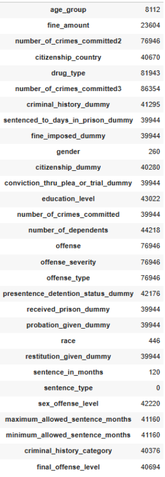
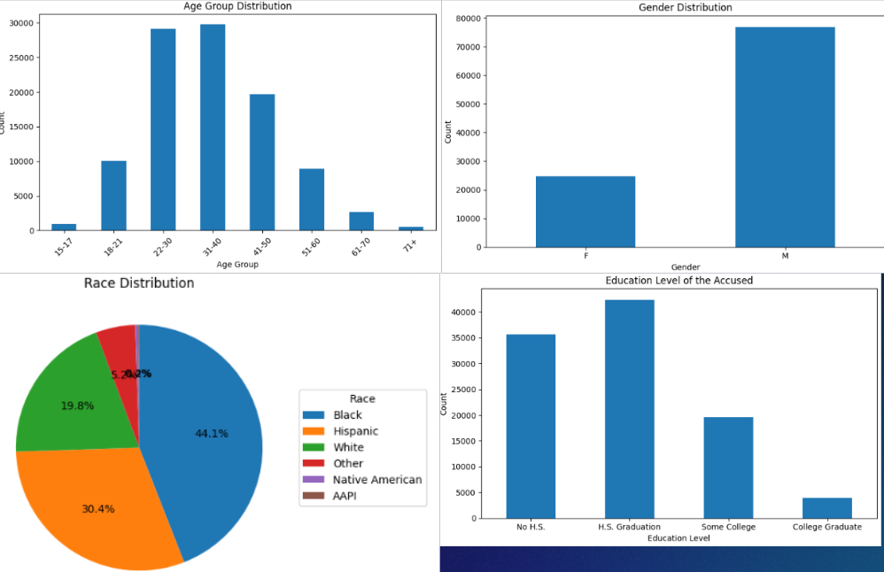
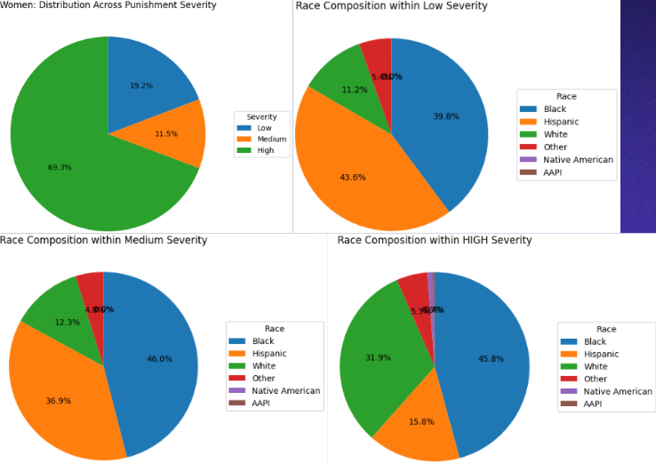
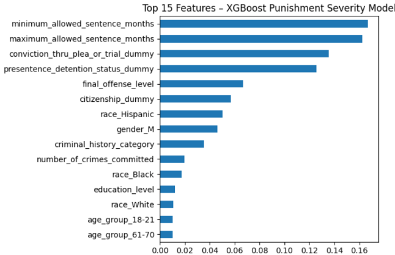
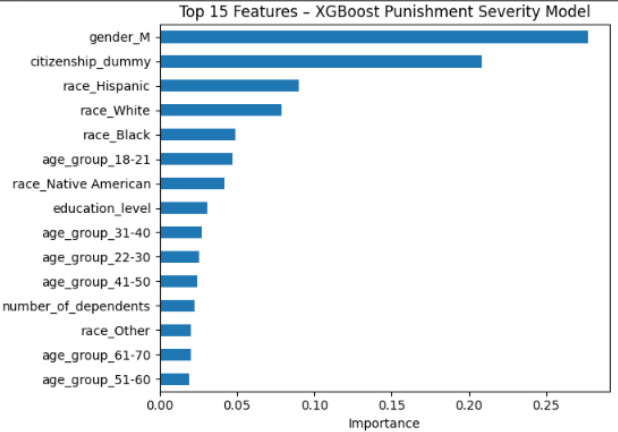
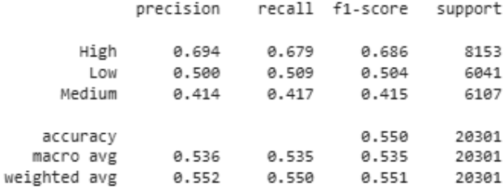

Mellors - MSDS696 - Practicum 2 - Bias and Disparity in Crime Punishment Severity

For my Practicum 2, I set out to explore biases and disparities in crime punishment severity within the U.S. criminal justice system. My goal was to analyze relationships between demographics and sentencing outcomes, identify where disparities may exist, and evaluate how well machine learning models can predict punishment severity based solely on demographic and crime-based features. Ultimately, this project looks at both the efficacy and the fairness of predictive policing.
My dataset was built by merging three datasets from the U.S. Sentencing Commission, Data.gov, and the University of Michigan. Combined, they made a dataset of slightly more than 100,000 entries. After heavy cleaning, handling duplicates, standardizing inconsistent columns, and dropping features with little-to-value or data, I ended with 23 usable features, falling into two categories: crime-based features (like sentencing lengths, number of crimes, prior history) and demographic features (race, gender, citizenship, age, education level, dependents).

Figure 1: NULLs 

One of the most important, but unfortunately most incomplete, features was crime severity, which was missing in nearly 80% of entries. That meant, I had to drop it. Dropping crime severity makes it impossible to directly compare crime severity with crime punishment severity, which would have been the strongest way to detect bias. Even without that comparison, however, the data itself clearly showed demographic disparities. The majority of individuals were between 22 and 40 years old, male (roughly 80%), and heavily represented by Black and Hispanic individual. I also found disproportionate educational levels, which often track with broader inequities within policing and prosecution.

Figure 2 Visuals of Demographic Features

To measure punishment severity, I had to create the target variable myself. I designed rules that balanced the classes: High severity included anyone sentenced to 60+ months in prison, or 12–59 months plus fines above $10,000. Medium severity captured moderate sentences or low sentences paired with high fines. Low severity included individuals receiving no sentence or minimal time without major fines. When I analyzed punishment severity by race and gender, the disparities were apparent. Nearly 70% of women in the dataset fell into the High-severity category despite being the minority gender. Black individuals made up a disproportionately high share of Medium and High severity punishments, and Native American and AAPI individuals, while underrepresented overall, were heavily feratured heavily in High severity as well.

Figure 3: Gender and Race distribution by Crime Severity

For modeling, I tested four classifiers: Logistic Regression, Random Forest, Decision Tree, and XGBoost. I trained them twice: once using all predictors (crime-based and demographics) and once using demographics only. In both cases, XGBoost performed the best. With all predictors, it achieved 78.5% accuracy and an F1 score of 0.773, meaning the model was both accurate and balanced across classes. The most important predictors were crime-based (maximum/minimum allowed sentence, final offense level), but demographic features—race, gender, citizenship, education—still appeared within the top contributors.

Figure 4: Top Features for All Predictors

When I trained a model using only demographic features, XGBoost again performed the best with 55% accuracy. That may seem low at first glance, but with three classes (High/Medium/Low), random guessing would land around 33%, and always picking the largest class would land around 40%. A 55% accuracy means demographics alone meaningfully predict punishment severity. That doesn’t prove causal bias (again, because I couldn’t compare crime seriousness to punishment seriousness) but it strongly supports the existence of disparities that align with well-documented systemic patterns in U.S. criminal justice. The top features utilized to make predictions included gender (male), citizenship, age group, and race. 

Figure 5: Top Features for Demographics Predictors

Figure 6: Demographics-Only Model Performance

In terms of limitations, several things are worth noting. First, the lack of crime severity data limited my ability to formally test bias. Second, the dataset of 100,000 entries represents only a small fraction of the individuals processed in the United States. Third, the amount of imputation required, while carefully done, may have inadvertently embedded or amplified existing biases in the data - to avoid this I did not impute crime-based features using demographic features and vice versa. And finally, I acknowledge my own belief in the research around systemic biases in policing; I worked deliberately to avoid allowing those beliefs to influence my decisions and findings.

Overall, the findings of this project show strong evidence of demographic disparities in sentencing outcomes and demonstrate that machine learning models, even when stripped of crime-based context, can detect those disparities. While this dataset cannot prove institutional bias alone, the patterns align with the broader known inequities we see documented across criminal justice and predictive policing research.